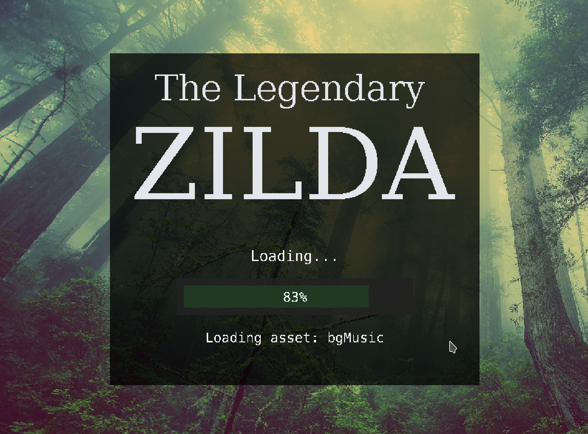
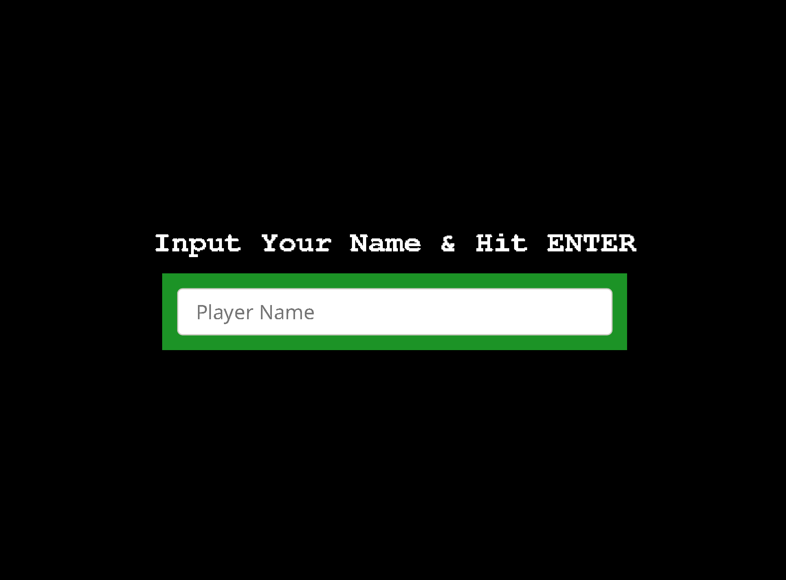
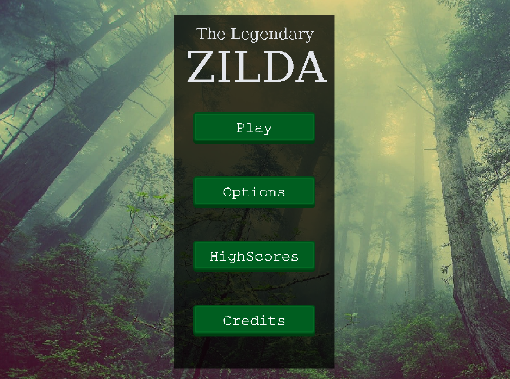
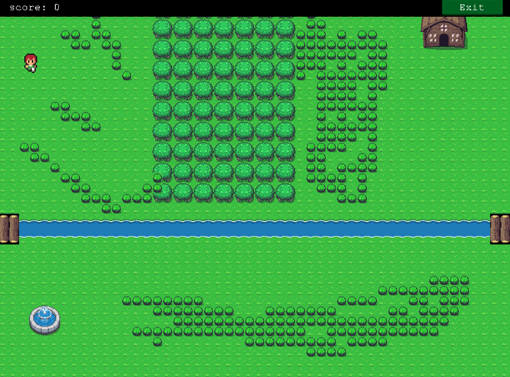
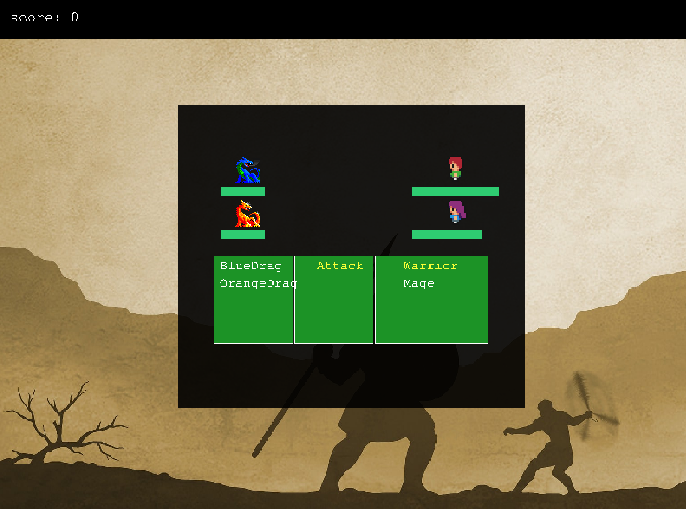

# Zilda - RPG Game
In this project, I have built a RPG game using Phaser 3 Framework. This project's main goal was to learn completely new technology and implement a fully working game in 5 work days, using best JavaScript practices.


## Built With

- JavaScript
- Phaser 3
- Webpack

## Live Demo

[Live demo](https://zilton7.github.io/zilda-rpg/)

## Game Instructions



Input your name and hit enter.



start the game by clicking on 'Play' button,
also you can change 'Options', check 'HighScore' table
or view 'credits'



Travel through the world using keyboard arrow keys, when you
reach particular places you will engage into the battle with dragons.



When in battle, use arrow keys to choose and space bar to confirm your characters attack and
try to defeat the enemies.

## About The Game

The Legendary Zilda is a turn-based role play game (RPG). The objective of this game is to remind people of old classical RPG games from the 90's and 00's. Game consists of two different playing scenes Battle and World. To make it competitive player's game points are recorded and stored online, everybody can get to the top of the rankings if they put enough effort and time.

Here's how I designed this game:

In the first day, I was researching online about classical RPG games, and I had a lot of ideas in my mind. I decided that creating a game where there are two game characters on one side fighting enemies on the other side is the best way to re-create that classic RPG vibe.
I decided to name my game 'Legendary Zilda'. It is a homage to probably the most famous RPG game 'The Legend of Zelda', blended with my name 'Zil'.
To make it more simple, I only used CC0 licensed sprites, images and sounds from openGame Art

To navigate in the world scene, player uses keyboard arrows up, down, left, right.

In battle scene, use keyboard arrows up, down, left and space bar to attack the choose enemy. Inside the battle scene player can see his characters' and enemies' health bars at all times.

Also there are player's score available to see in the top bar in both of the scenes, when player want to quit, he can use the button 'Exit' in the top right of the bar, after clicking said button player is taken to High Score scene, where all top players and their scores are listed.

Player has 2 main characters, warrior and mage, with whom battles are fought

Enemies are 2 dragoons red and blue.
## Setup

To clone this repository run:

```
git clone git@github.com:zilton7/zilda-rpg.git
```

To install the dependencies run:
```
npm install
```

To run the game:
```
npm run start
```
The browser window should popup with the game pre-loading.


## Testing
Run tests with the following command:
```
npm test
```


## Usage


## AUTHOR

**ZIL NORVILIS**

- Github: [](https://github.com/zilton7)
- Linkedin: [](https://www.linkedin.com/in/zil-norvilis/)
- Twitter: [](https://twitter.com/devnor7)


## Show your support

Give a ⭐️ if you like this project!

## Acknowledgments

- Hat tip to anyone whose code was used.
- Inspiration
- etc
